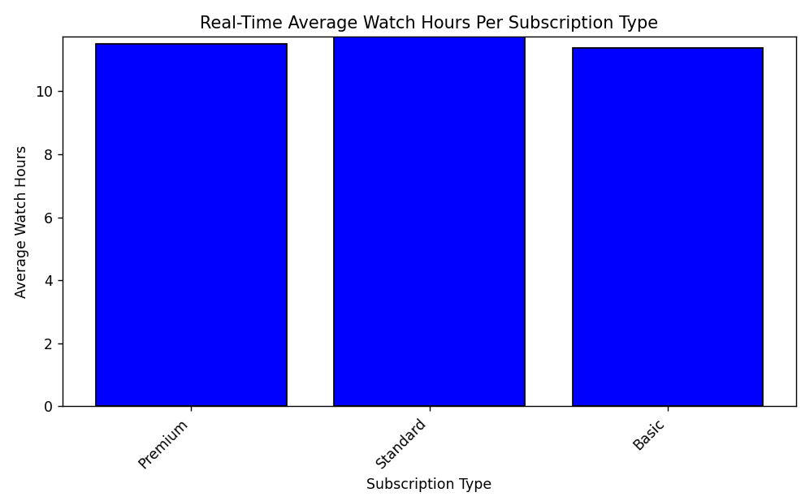

# buzzline-06-sahoward

Week 6 Project - Streaming Data

This project will attempt to review data from Netflix to determine the impact of subscription type and number of hours watched.

## Start WSL
Launch WSL. Open a PowerShell terminal in VS Code. Run the following command:

wsl

You should now be in a Linux shell (prompt shows something like username@DESKTOP:.../repo-name$).

Do all steps related to starting Kafka in this WSL window.

## Start Kafka
Start Kafka (using WSL if Windows)
Make sure the script is executable.
Run the shell script to set up Kafka.
Cd (change directory) to the kafka directory.
Start the Kafka server in the foreground. Keep this terminal open - Kafka will run here.
chmod +x scripts/prepare_kafka.sh
scripts/prepare_kafka.sh
cd ~/kafka
bin/kafka-server-start.sh config/kraft/server.properties
Keep this terminal open! Kafka is running and needs to stay active.

## Manage Local Project Virtual Environment
Manage Local Project Virtual Environment
Open your project in VS Code and use the commands for your operating system to:

Create a Python virtual environment.
Activate the virtual environment.
Upgrade pip and key tools.
Install from requirements.txt.
Windows
Open a new PowerShell terminal in VS Code (Terminal / New Terminal / PowerShell). Python 3.11 is required for Apache Kafka.

py -3.11 -m venv .venv
.\.venv\Scripts\Activate.ps1
py -m pip install --upgrade pip wheel setuptools
py -m pip install --upgrade -r requirements.txt
py -m pip install kafka-python pandas matplotlib
If you get execution policy error, run this first: Set-ExecutionPolicy -ExecutionPolicy RemoteSigned -Scope CurrentUser

Mac / Linux
Open a new terminal in VS Code (Terminal / New Terminal)

python3 -m venv .venv
source .venv/bin/activate
python3 -m pip install --upgrade pip
python3 -m pip install --upgrade -r requirements.txt
Task 3. Run Tests and Verify Emitters
In the same terminal used for Task 2, we'll run some tests to ensure that all four emitters are working fine on your machine. All tests should pass if everything is installed and set up correctly.

pytest -v
Then run the verify_emitters.py script as a module to check that we can emit to all four types. For the Kakfa sink to work, the Kafka service must be running.

Windows Powershell
py -m verify_emitters
Mac / Linux
python3 -m verify_emitters

## Start a New Streaming Application
This will take two terminals:

One to run the producer which writes messages using various emitters.
Another to run each consumer.
Producer Terminal (Outputs to Various Sinks)
Start the producer to generate the messages.

The existing producer writes messages to a live data file in the data folder. If the Kafka service is running, it will try to write the messages to a Kafka topic as well. For configuration details, see the .env file.

In VS Code, open a NEW terminal. Use the commands below to activate .venv, and start the producer.

Windows:

.\.venv\Scripts\Activate.ps1
py -m producers.producer_sahoward
Mac/Linux:

source .venv/bin/activate
python3 -m producers.producer_sahoward
NOTE: The producer will still work if the Kafka service is not available.

Consumer Terminal
The below consumer will calculate the average hours watched for each subscription type and update one message at a time.

In VS Code, open a NEW terminal in your root project folder. Use the commands below to activate .venv, and start the consumer.

Windows:

.\.venv\Scripts\Activate.ps1
py -m consumers.consumer_sahoward
Mac/Linux:

source .venv/bin/activate
python3 -m consumers.consumer_sahoward
Review the Project Code
Review the requirements.txt file.

## Analyzing the results

The consumer is reading the subscription type and calculating the average number of watch hours. In looking at the results, the average number of hours watched does not vary much whether the subscription type is premium, standard, or basic.

Based on this data, it would appear that there are other factors that are more critical in determining whether a customer will churn with Netflix.